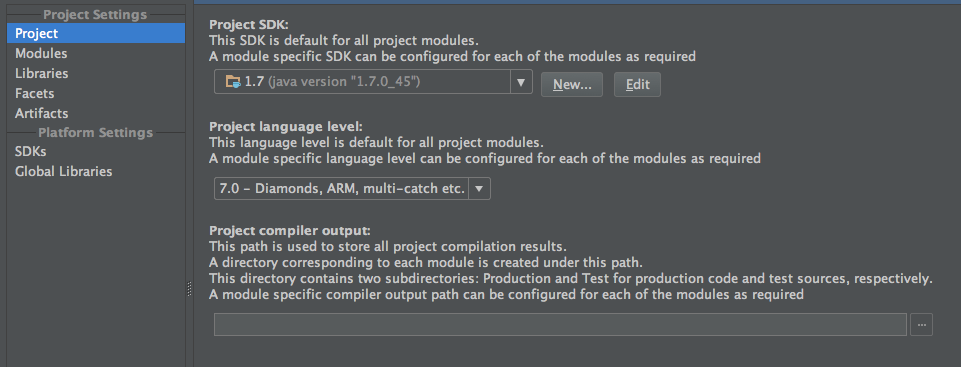
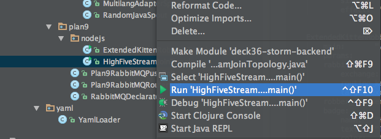
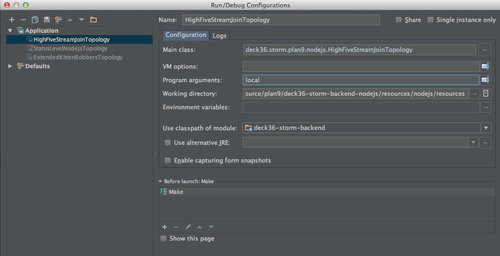

# Storm Topologies for the "Plan9 From Outer Space" Tutorial Game

## 1. Setup project 

	# run within the Plan9 vagrant
	./prepare.sh


## 2. Within the "deck36-php-web-app" project, make sure, you created your production phar file in the `target/resources` directory. 

## 3. Compile and build deployable jar file 

	# run within the Plan9 vagrant
	./build.sh


## 4. Setup local machine IDE

The instructions provided here work with Intellij 13 Community Edition. IDE's other than Intellij are not supported at the moment. If you use an other IDE create a setup procedure, we appreciate your pull request. 

In your local machine (not within the vagrant), go to the "deck36-storm-backend-nodejs" project. The `./prepare.sh` script we executed within the vagrant already created IDEA project files. However, they lack local configuration for the maven repository, JDK/language settings, and project structure.

Set correct maven repository directory in IDEA .iml file. We provide the "patch_local_m2_dir.sh" script to automatically update the iml file. In the background, the vagrant mounts a local directory as its maven repository dir, so we have access to it.

```
# run in your local environment 
./patch_local_m2_dir.sh
```

Start up Intellij and open the deck36-storm-backend-nodejs.ipr project file. Enter File->Project Structure and choose your JDK. A JDK version of 1.7+ is required. Increase the language level to at least 7.0.




In the same window of File->Project Structure, navigate to "Modules" under "Project Settings". Now configure the path structure: Add "src/jvm" as "source directory". Remove "src" as "source" directory. Add "resources/config" as "resources" directory. The other settings in the screenshot are optinal.


In the project tree viewer, navigate to the HighFiveStreamJoinTopology, activate the context menu and choose "run". This will create a configuration to run that particular class. The execution will abort with an error regarding missing command line parameters.



Configure the command line parameters for executing the topology. Enter Run->Edit Configurations and set "Program arguments" to "local".




## Run Locally (for testing)

In our vagrant enviroment, Storm is installed in `/opt/storm`. We can thus execute the topology locally by:

	/opt/storm/bin/storm jar target/deck36-storm-backend-php-0.0.1-SNAPSHOT-standalone.jar deck36.storm.plan9.php.HighFiveBadgeTopology dev

Note: To run the topology in dev mode within the vagrant, make sure your node binary and javascript paths in the yaml files (see resources/config)  are correct and don't differ due to your local development machine setup.


### Deploy to Cluster 

Deploying to a cluster is very simple as well, because all the cluster config is handled by the `storm` command. We thus just need to switch `dev` to `prod`:

	/opt/storm/bin/storm jar target/deck36-storm-backend-php-0.0.1-SNAPSHOT-standalone.jar deck36.storm.plan9.php.HighFiveBadgeTopology prod


## Deploy pre-built PHP topology that manages user points and status levels

The updates of user generated points and respective status levels are managed by a PHP bolt that is able to use the data entities defined in the PHP project. In order to focus on the Node.js part here, we provide a pre-built jar file with that functionality. In order to play Plan9, deploy that the StatusLevelTopology to the cluster:

	/opt/storm/bin/storm jar resources/deck36-storm-backend-php-0.0.1-SNAPSHOT-standalone.jar deck36.storm.plan9.php.StatusLevelTopology prod

TODO: start the other topologies as well. 


